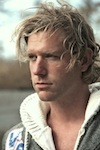
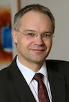
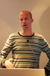

# Personas

| Name | Anne | Matthijs | Klaus | Preethi | Sandra | Tim |
|------|:-------:|:-----------:|:-------:|:---------:|:----------:|:------:|
| Photo ||||||
|Age|25|34|49|30|36|39|
|Job Title|Admin Assistant|Project Manager|Marketing Director|Project Officer|Programme Manager|Web Developer|
|Organisation|Water World Foundation|Water World Foundation|Water World Foundation|India Water Ltd|Water World Foundation|Tech for Water|
|Hobbies|Blogging, Zhumba, Hanging with friends|Travelling, Learning Languages, iPhone apps|Family holidays, Skiing, Sudoku|Raising her child, Photography, Social Media|Swimming, Hockey and Dinner Parties|Football, Tech Conferences, Making Educational Apps|
|Summary|Anne is a parttime Intern at Water World Foundation while studying Environment Science.|Matthijs runs large internal projects at Water World Foundation. He is responsible for the implementation of RSR and discussing new features and changes.|Klaus has been working at Water World Foundation for 15 years. He has risen through the Marketing and Communications department and sits on the board of directors for the past 3 years.|Preethi works for India Water Ltd on Water Projects funded by Water World Foundation. She is the primary contact between the organisations.|Sandra is Programme Manager for Water World Foundation, responsible for projects being carried out in India, Pakistan and Bangladesh. Sandra is in the region at least once per year connecting with the Project Officers|Tim is a freelancer for his company Tech for Water. He provides web development and consulting for the water sector. At the moment Tim works primarily for Water World Foundation.|
|Responsibilities|Anne approves new RSR users and provides basic support for her organisation for using RSR|Matthijs ensures that RSR is providing the right benefits to his organisation. He evaluates RSR and is in regular contact with RSR and Water World Foundation Management.|Klaus provides strategy and direction for Water World Foundation. He is always looking for ways to improve the organisation's reputation and vision, but is very conscious of budget constraints.|Preethi is responsible for reporting on her project progress to Water World Foundation and providing updates from her team.|Sandra collects and delivers content for RSR projects as well as reviewing updates provided by the Project Officers in her region.|Tim is responsible for building and maintaining the web platform for Water World Foundation, including the integration of their systems with RSR.|
|RSR Training|Anne has received 1-on-1 Admin training from the Akvo Partner Team|Matthijs has had an introduction to RSR and Admin, but is comfortable discovering for himself.|Klaus has an RSR Account that his PA registered for him. He only logs in when he is showing RSRas meetings, and often forgets his details|Preethi received Field Training from Akvo Asia mainly focussing on adding Updates| Sandra received an introduction to RSR, but mainly uses the Project PDF form|Tim has had no RSR training. He requires technical documentation to be made available, but is hands on to determine how things work.|
|RSR Routes|Approve users, Add Organisation, Contact RSR Support, Login, Registration|Approve users, Portfolio Information, Billing, Login, Registration|Portfolio Information, Billing, Reports, Login|Add updates, Registration, Login|Add/Edit Project, Add update, Portfolio Information, Login, Registration|API Read, API Write, Embed Widgets, Akvo Pages, Login, Registration|

